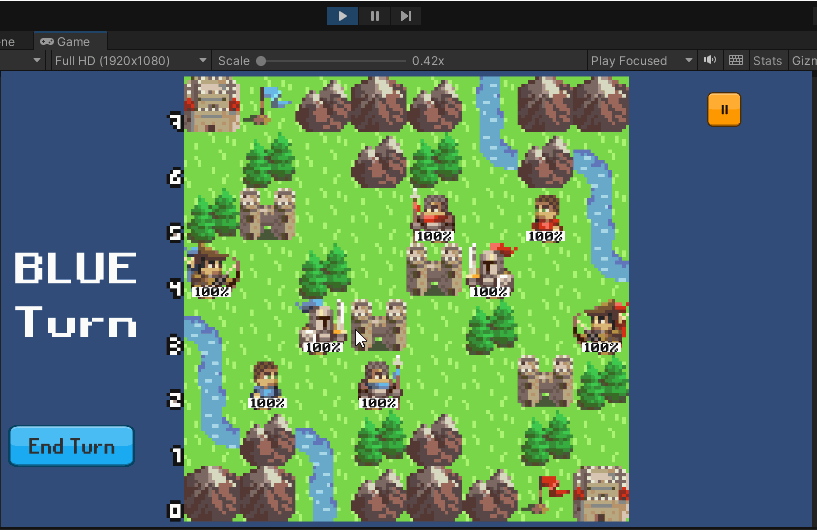

# Medieval-War-boardgame_Unity
A boardgame where you control 4 characters to occupy opponent's castle. Game supports play PvP on same machine or play with AI using Minimax.  

 Each characters have different stats about number of tiles can move, attack power and HP. 

 The tiles on map also have different characteristics:

<ul>
  <li>Castle heals HP at the end of turn.</li>
  <li>Tree gives you more defense power.</li>
</ul>

Through this project, I have learned 

<ul>
  <li>Create a Turn-based strategy board game.</li>
  <li>Apply AI algorimth to game.</li>
</ul>

